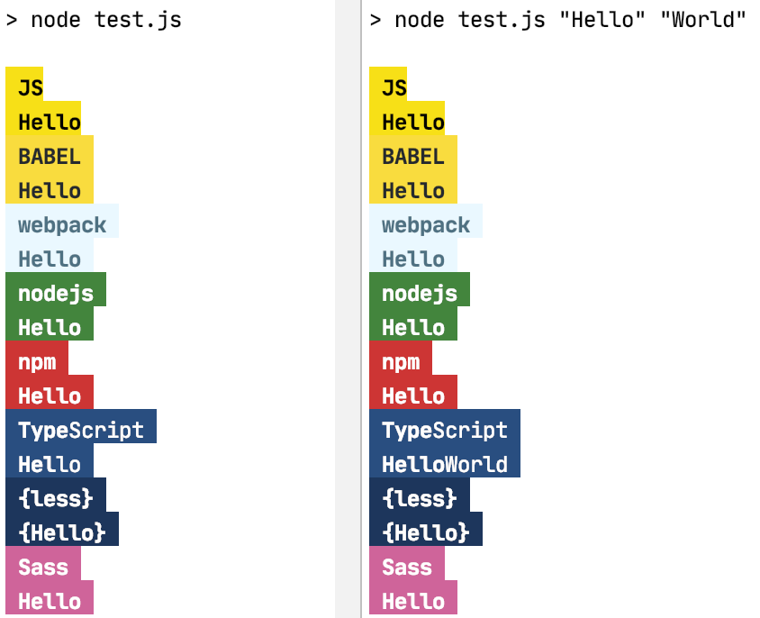

# Write colourfully with your preferred developer patterns

## example

```javascript
console.info(test.js);
console.info(test.jsPattern('Hello'));
console.info(test.babel);
console.info(test.babelPattern('Hello'));
console.info(test.typeScript);
console.info(test.typeScriptPattern('Hel', 'lo'));
console.info(test.less);
console.info(test.lessPattern('Hello'));

```


